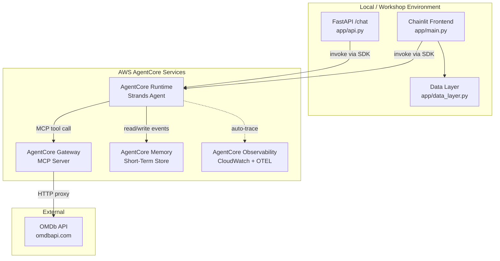

# Design Document: AgentCore Integration

## Overview

This design describes how to migrate CineAgent from its current direct boto3 Bedrock Converse API implementation to AWS AgentCore services. The migration replaces three core capabilities:

1. **Agent Execution** — Current `BedrockClient` with its manual tool-use loop → AgentCore Runtime via the `bedrock-agentcore` Python SDK using Strands Agents framework
2. **Tool Calling** — Current `OMDbTool` with direct httpx calls → AgentCore Gateway with an OpenAPI target pointing at the OMDb API
3. **Session Memory** — Current in-memory Python dict → AgentCore Memory (short-term memory) with per-session conversation storage

Additionally, AgentCore Observability provides tracing automatically when the agent runs on AgentCore Runtime.

### Design Rationale

Since this is a **workshop project**, the design prioritizes:
- Simplicity and readability over production hardening
- Minimal code changes to preserve the existing frontend experience
- Use of the high-level `bedrock-agentcore` SDK rather than low-level boto3 calls
- A "client-mode" architecture where the Chainlit app calls a deployed AgentCore Runtime agent, keeping the existing `app/main.py` structure intact

### Key Research Findings

- The `bedrock-agentcore` Python SDK provides `BedrockAgentCoreApp` for deployment and `MemoryClient` for memory operations
- AgentCore Gateway exposes tools via the MCP (Model Context Protocol) standard, accepting OpenAPI specs for API targets
- The recommended agent framework is **Strands Agents** (`strands-agents`), which integrates natively with AgentCore Runtime
- Observability is automatic for Runtime-hosted agents via `aws-opentelemetry-distro`
- For our workshop's hybrid architecture (Chainlit frontend + AgentCore backend), we use `AgentCoreRuntimeClient` to invoke the deployed agent programmatically

Sources:
- [AgentCore Runtime SDK Overview](https://aws.github.io/bedrock-agentcore-starter-toolkit/user-guide/runtime/overview.html)
- [AgentCore Memory SDK](https://docs.aws.amazon.com/bedrock-agentcore/latest/devguide/agentcore-sdk-memory.html)
- [AgentCore Gateway Quickstart](https://aws.github.io/bedrock-agentcore-starter-toolkit/user-guide/gateway/quickstart.html)
- [AgentCore Observability Quickstart](https://aws.github.io/bedrock-agentcore-starter-toolkit/user-guide/observability/quickstart.html)

## Architecture

The migration splits the system into two deployable units:

1. **Chainlit Frontend App** (runs locally or on EC2) — unchanged UI, calls AgentCore Runtime
2. **AgentCore Runtime Agent** (deployed to AWS) — Strands Agent with Gateway tools and Memory hooks



### Invocation Flow

1. User sends message via Chainlit or FastAPI `/chat`
2. `AgentCoreClient` (new module replacing `BedrockClient`) calls `AgentCoreRuntimeClient.invoke()` with the user prompt and session ID
3. AgentCore Runtime receives the request, loads conversation context from Memory, and runs the Strands Agent
4. The agent uses the `search_movie` tool via Gateway (which proxies to OMDb API)
5. Gateway returns tool results; the agent formulates a response
6. Runtime stores the conversation turn in Memory and returns the response
7. `AgentCoreClient` extracts the text response and poster URLs, returns to the Chainlit handler

## Components and Interfaces

### New Files

| File | Purpose |
|------|---------|
| `app/agentcore_client.py` | Runtime client that replaces `BedrockClient` — invokes the deployed agent |
| `agentcore_agent/entrypoint.py` | The Strands Agent deployed to AgentCore Runtime |
| `agentcore_agent/requirements.txt` | Dependencies for the deployed agent |
| `setup/setup_gateway.py` | One-time script to create Gateway + OMDb OpenAPI target |
| `setup/setup_memory.py` | One-time script to create Memory resource |

### Modified Files

| File | Change |
|------|--------|
| `app/config.py` | Add AgentCore env vars (AGENTCORE_RUNTIME_ARN, AGENTCORE_REGION, MEMORY_ID, GATEWAY_URL, GATEWAY_ACCESS_TOKEN) |
| `app/main.py` | Replace `BedrockClient` instantiation with `AgentCoreClient`; update poster extraction |
| `app/api.py` | Change type hint from BedrockClient to AgentCoreClient (interface-compatible) |
| `requirements.txt` | Add `bedrock-agentcore`, `strands-agents` |
| `.env.example` | Add new environment variables |

### Unchanged Files

| File | Reason |
|------|--------|
| `app/models.py` | Data models unchanged |
| `app/data_layer.py` | Chainlit sidebar persistence unchanged |
| `app/omdb_tool.py` | Kept for reference/testing; Gateway replaces it in production path |

### Component Interfaces

#### `AgentCoreClient` (replaces `BedrockClient`)

```python
class AgentCoreClient:
    """Invokes the CineAgent deployed on AgentCore Runtime."""

    def __init__(
        self,
        runtime_arn: str,
        region: str,
    ) -> None: ...

    async def process_message(self, query: str, session_id: str) -> str:
        """Send a message to the agent and return the text response.

        Maintains the same interface as BedrockClient.process_message
        so main.py and api.py require minimal changes.
        """
        ...

    @property
    def last_posters(self) -> list[str]:
        """Poster URLs from the most recent invocation."""
        ...
```

#### `agentcore_agent/entrypoint.py` (deployed agent)

```python
from bedrock_agentcore.runtime import BedrockAgentCoreApp
from bedrock_agentcore.memory import MemoryClient
from strands import Agent
from strands.models import BedrockModel

app = BedrockAgentCoreApp()

@app.entrypoint
def invoke(payload, context):
    """
    payload: {"prompt": str, "session_id": str}
    returns: {"response": str, "posters": list[str]}
    """
    ...
```

#### Gateway OpenAPI Target (OMDb)

The Gateway target uses an OpenAPI spec to proxy calls to `http://www.omdbapi.com/` with the API key injected as a query parameter credential.

```python
omdb_openapi_spec = {
    "openapi": "3.0.0",
    "info": {"title": "OMDb API", "version": "1.0.0"},
    "servers": [{"url": "http://www.omdbapi.com"}],
    "paths": {
        "/": {
            "get": {
                "operationId": "search_movie",
                "summary": "Search for a movie or TV series by title",
                "parameters": [
                    {
                        "name": "t",
                        "in": "query",
                        "required": True,
                        "schema": {"type": "string"},
                        "description": "Title of the movie or TV series",
                    }
                ],
                "responses": {
                    "200": {
                        "description": "Movie/series metadata",
                        "content": {"application/json": {"schema": {"type": "object"}}}
                    }
                }
            }
        }
    },
}
```

### AppConfig Extension

```python
@dataclass
class AppConfig:
    # Existing fields
    omdb_api_key: str
    aws_region: str
    bedrock_model_id: str
    # New AgentCore fields
    agentcore_runtime_arn: str
    agentcore_region: str
    memory_id: str
    gateway_url: str
    gateway_access_token: str
```

## Data Models

### Invocation Payload (Client → Runtime)

```json
{
  "prompt": "Tell me about The Matrix",
  "session_id": "550e8400-e29b-41d4-a716-446655440000"
}
```

### Invocation Response (Runtime → Client)

```json
{
  "response": "The Matrix (1999) is a sci-fi action film...",
  "posters": ["https://m.media-amazon.com/images/M/..."]
}
```

### Memory Event Structure

Each conversation turn is stored as an AgentCore Memory event:

```python
memory_client.create_event(
    memory_id=MEMORY_ID,
    actor_id="workshop-user",
    session_id=session_id,
    messages=[
        (user_message, "USER"),
        (assistant_response, "ASSISTANT"),
    ],
)
```

Retrieval uses `get_last_k_turns()` with `k=10` (20 messages / 2 messages per turn = 10 turns) to match the current 20-message limit.

### Environment Variables

| Variable | Description | Example |
|----------|-------------|---------|
| `AGENTCORE_RUNTIME_ARN` | ARN of the deployed agent | `arn:aws:bedrock-agentcore:us-east-1:123456789:agent/abc123` |
| `AGENTCORE_REGION` | Region where AgentCore is deployed | `us-east-1` |
| `MEMORY_ID` | AgentCore Memory resource ID | `mem-abc123def456` |
| `GATEWAY_URL` | Gateway MCP endpoint URL | `https://gw-id.gateway.bedrock-agentcore.us-east-1.amazonaws.com/mcp` |
| `GATEWAY_ACCESS_TOKEN` | OAuth token for Gateway access | `eyJhbGci...` |
| `OMDB_API_KEY` | OMDb API key (used by Gateway) | `de3d5a9d` |
| `AWS_REGION` | AWS region (existing) | `us-east-1` |
| `BEDROCK_MODEL_ID` | Model ID (existing) | `anthropic.claude-3-haiku-20240307-v1:0` |


## Error Handling

### Error Propagation Strategy

The design preserves the existing error handling patterns in `main.py` and `api.py` — the `AgentCoreClient` raises exceptions, and callers handle them with try/except blocks.

| Error Scenario | Source | Handling |
|----------------|--------|----------|
| Runtime unreachable | Network/AWS | `AgentCoreClient` raises `ConnectionError`; callers display generic error message |
| Runtime returns error | AgentCore SDK | `AgentCoreClient` raises `RuntimeError` with descriptive message |
| Memory unreachable | Network/AWS | Agent logs warning, continues without history context (graceful degradation) |
| Gateway/OMDb timeout | Gateway proxy | Gateway returns error tool result; agent tells user title wasn't found |
| Invalid session ID | Validation | `AgentCoreClient` validates format before calling Runtime |
| Missing env vars | Startup | `load_config()` logs error and exits with code 1 (existing pattern) |
| Tracing init failure | OTEL setup | Log warning, continue without tracing |

### Graceful Degradation Hierarchy

1. **Memory failure** → Agent processes message without conversation history (stateless mode)
2. **Gateway failure** → Agent cannot call tools; responds that it cannot look up movies right now
3. **Runtime failure** → Error propagates to user as "Sorry, I encountered an error..."
4. **Observability failure** → Completely silent; agent works normally without tracing

### Error Response Format

The `AgentCoreClient` maintains the same exception contract as `BedrockClient`:
- Raises standard Python exceptions (`ConnectionError`, `RuntimeError`, `TimeoutError`)
- The `api.py` timeout logic (30s `asyncio.wait_for`) continues to wrap calls
- Error messages never expose internal AWS details to the user

## Testing Strategy

### Why Property-Based Testing Does Not Apply

This feature is primarily an **integration/infrastructure migration**. The code being written consists of:
- Service client wrappers that call external APIs (AgentCore Runtime, Memory, Gateway)
- Configuration loading from environment variables
- Response parsing of fixed-format JSON payloads

There are no pure functions with universal properties across a wide input space. The behavior is deterministic for a given external service response, and testing different inputs (user messages) does not exercise different code paths in our client logic — it exercises the LLM on the remote service. Property-based testing would add cost without finding bugs.

### Test Approach

**Unit Tests (mocked):**
- `AgentCoreClient.process_message()` with mocked `AgentCoreRuntimeClient`
- Response parsing (text extraction, poster URL extraction)
- Error handling (connection errors, timeouts, malformed responses)
- `load_config()` with new environment variables (present, missing, empty)
- Memory graceful degradation (mock MemoryClient raising exceptions)

**Integration Tests (real services):**
- End-to-end invocation of deployed agent with a movie query
- Verify Gateway routes to OMDb and returns structured data
- Verify Memory stores and retrieves conversation turns
- Verify tracing spans appear in CloudWatch

**Smoke Tests:**
- System prompt constant matches expected value
- Model ID configuration is correct
- All required env vars validated at startup
- `requirements.txt` includes new dependencies

### Test File Structure

```
tests/
├── test_agentcore_client.py    # Unit tests for the new client (mocked)
├── test_config.py              # Extended config validation tests
├── test_api.py                 # Verify /chat still works with new client
└── integration/
    └── test_agentcore_e2e.py   # End-to-end with real services (manual)
```

### Test Tools

- **pytest** + **pytest-asyncio** for async test execution
- **unittest.mock** / **pytest-mock** for mocking AgentCore SDK calls
- **hypothesis** retained in requirements but not used for this feature
- Integration tests run manually during workshop (require AWS credentials)
