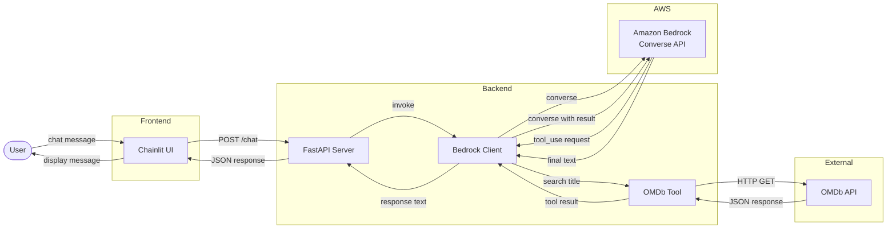
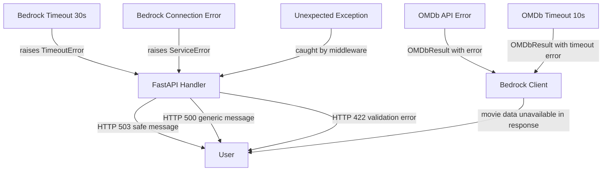

# Design Document: CineAgent

## Overview

CineAgent is a conversational movie and TV series recommendation agent designed as an AWS workshop project. It demonstrates how to build an AI-powered chat application using Amazon Bedrock's Converse API with tool use, a FastAPI backend, a Chainlit frontend, and the OMDb API for real movie data.

The system follows a simple, didactic architecture:

```
User → Chainlit Frontend → FastAPI Backend → Amazon Bedrock (Converse API) → OMDb API → Response
```

The design prioritizes clarity and educational value over production-grade complexity. Each component has a single responsibility and communicates through well-defined interfaces.

## Architecture



### Key Architectural Decisions

1. **Chainlit mounted on FastAPI**: Chainlit can be mounted as a sub-application of FastAPI, allowing both the chat UI and the API to run on the same server. This simplifies deployment for the workshop.

2. **Bedrock Converse API with Tool Use**: Instead of manually parsing model outputs to detect when a tool call is needed, we use Bedrock's native Converse API which provides structured tool use. The model decides when to call the OMDb tool, and we handle the tool execution loop.

3. **In-memory session storage**: Conversation history is stored in a Python dictionary keyed by session ID. This is sufficient for a workshop and avoids database dependencies.

4. **No AgentCore / No frameworks**: The agent loop is implemented directly using boto3 and the Converse API. This makes the code transparent and educational.

## Components and Interfaces

### 1. Chainlit Frontend (`app.py`)

The Chainlit application provides the web chat UI and communicates with the FastAPI backend.

**Responsibilities:**
- Render the chat interface
- Send user messages to the `/chat` endpoint
- Display assistant responses
- Show a loading indicator while waiting for responses

**Interface:**
```python
# Chainlit message handler
@cl.on_message
async def on_message(message: cl.Message) -> None:
    """Handle incoming user message, call backend, display response."""
    ...
```

### 2. FastAPI Backend (`api.py`)

The REST API layer that receives chat requests and orchestrates the agent logic.

**Responsibilities:**
- Expose `POST /chat` endpoint
- Validate incoming request payloads
- Invoke the Bedrock Client with the user query and session ID
- Return the agent response or appropriate error codes
- Enforce the 30-second timeout

**Interface:**
```python
@app.post("/chat", response_model=ChatResponse)
async def chat(request: ChatRequest) -> ChatResponse:
    """Process a chat message and return the agent response."""
    ...
```

### 3. Bedrock Client (`bedrock_client.py`)

Manages communication with Amazon Bedrock's Converse API, including the tool-use loop.

**Responsibilities:**
- Maintain the system prompt defining CineAgent's persona
- Build and manage conversation history per session (max 20 messages)
- Send messages to Bedrock via the Converse API
- Detect `tool_use` stop reasons and dispatch to OMDb Tool
- Return tool results back to Bedrock for final answer generation
- Reject off-topic queries

**Interface:**
```python
class BedrockClient:
    def __init__(self, region: str, model_id: str) -> None: ...

    async def process_message(self, query: str, session_id: str) -> str:
        """Process a user query and return the assistant response."""
        ...
```

### 4. OMDb Tool (`omdb_tool.py`)

Queries the OMDb API to retrieve movie and TV series information.

**Responsibilities:**
- Query OMDb API by title
- Parse and structure API responses
- Handle timeouts (10s), errors, and "not found" cases
- Validate that a non-empty title is provided before making API calls
- Extract metadata: title, year, plot, genre, ratings, type, totalSeasons

**Interface:**
```python
class OMDbTool:
    def __init__(self, api_key: str, timeout: float = 10.0) -> None: ...

    async def search_by_title(self, title: str) -> OMDbResult:
        """Search OMDb API by title. Returns structured result or error."""
        ...
```

### 5. Configuration (`config.py`)

Loads and validates environment variables at startup.

**Interface:**
```python
class AppConfig:
    omdb_api_key: str
    aws_region: str
    bedrock_model_id: str

def load_config() -> AppConfig:
    """Load config from environment variables. Raises SystemExit if missing."""
    ...
```

## Data Models

### Request/Response Models

```python
from pydantic import BaseModel, Field

class ChatRequest(BaseModel):
    """Incoming chat request from the frontend."""
    query: str = Field(..., min_length=1, max_length=2000)
    session_id: str = Field(..., min_length=1, max_length=128)

class ChatResponse(BaseModel):
    """Response returned to the frontend."""
    response: str
    session_id: str

class ErrorResponse(BaseModel):
    """Error response for API errors."""
    error: str
    detail: str | None = None
```

### OMDb Data Models

```python
from dataclasses import dataclass

@dataclass
class OMDbResult:
    """Structured result from OMDb API query."""
    success: bool
    title: str | None = None
    year: str | None = None
    plot: str | None = None
    genre: str | None = None
    ratings: list[dict[str, str]] | None = None
    content_type: str | None = None  # "movie" or "series"
    total_seasons: str | None = None
    error: str | None = None
```

### Session Storage

```python
# In-memory conversation history
# Key: session_id (str)
# Value: list of Bedrock Converse API message objects
sessions: dict[str, list[dict]] = {}
```

### Bedrock Tool Definition

The OMDb tool is defined as a Bedrock tool spec for the Converse API:

```python
OMDB_TOOL_SPEC = {
    "toolSpec": {
        "name": "search_movie",
        "description": "Search for a movie or TV series by title using the OMDb API. Returns title, year, plot, genre, ratings, type, and number of seasons.",
        "inputSchema": {
            "json": {
                "type": "object",
                "properties": {
                    "title": {
                        "type": "string",
                        "description": "The title of the movie or TV series to search for"
                    }
                },
                "required": ["title"]
            }
        }
    }
}
```

## Correctness Properties

*A property is a characteristic or behavior that should hold true across all valid executions of a system — essentially, a formal statement about what the system should do. Properties serve as the bridge between human-readable specifications and machine-verifiable correctness guarantees.*

### Property 1: Request validation accepts valid inputs and rejects invalid inputs

*For any* JSON request body, the FastAPI endpoint SHALL accept the request if and only if `query` is a non-empty string of at most 2000 characters and `session_id` is a non-empty string of at most 128 characters; otherwise it SHALL return HTTP 422 with an indication of which field failed validation.

**Validates: Requirements 2.1, 2.4**

### Property 2: Valid request-response pass-through

*For any* valid chat request and any mocked Bedrock client response string, the FastAPI endpoint SHALL return a response containing the exact response text from the Bedrock client and the same session_id from the original request.

**Validates: Requirements 2.2, 2.3**

### Property 3: System prompt always included

*For any* user query forwarded to the Bedrock client, the Converse API call SHALL include the system prompt defining CineAgent as a movie and TV series assistant, in addition to the user's query message.

**Validates: Requirements 3.1**

### Property 4: Session history bounded at 20 messages

*For any* sequence of N messages sent to the same session, the stored conversation history SHALL contain at most 20 messages, preserving the most recent messages when the limit is exceeded.

**Validates: Requirements 3.4**

### Property 5: OMDb response extraction completeness

*For any* valid OMDb API JSON response with `Response: "True"`, the OMDb tool SHALL extract title, year, plot, genre, ratings, and type; and when type is "series", SHALL additionally extract totalSeasons.

**Validates: Requirements 4.2, 6.3**

### Property 6: Empty or blank title rejection

*For any* string composed entirely of whitespace characters (including the empty string), the OMDb tool SHALL return an error indicating a non-empty title is required, without making any HTTP request to the OMDb API.

**Validates: Requirements 4.5**

### Property 7: Configuration validation at startup

*For any* combination of environment variable values for OMDB_API_KEY, AWS_REGION, and BEDROCK_MODEL_ID, the application SHALL start successfully if and only if all three are present and non-empty; otherwise it SHALL log an error specifying the missing variable and terminate with a non-zero exit code.

**Validates: Requirements 7.4, 7.5**

### Property 8: Error responses never expose internal details

*For any* error that occurs during request processing (Bedrock timeout, unexpected exceptions, OMDb failures), the HTTP error response body SHALL not contain stack traces, file paths, third-party service endpoints, or credentials.

**Validates: Requirements 8.3, 8.4**

## Error Handling

### Error Handling Strategy

The application uses a layered error handling approach where each component catches its own errors and translates them into structured responses for the layer above.



### Error Categories

| Error Source | Error Type | HTTP Code | User Message |
|---|---|---|---|
| Request validation | Missing/invalid fields | 422 | Field-specific validation error |
| Bedrock | Timeout (>30s) | 503 | AI service temporarily unavailable |
| Bedrock | Connection failure | 503 | AI service temporarily unavailable |
| OMDb | Timeout (>10s) | — | Communicated via agent response |
| OMDb | HTTP error | — | Communicated via agent response |
| OMDb | Not found | — | Communicated via agent response |
| OMDb | Empty title | — | Returned as tool error to Bedrock |
| System | Unexpected error | 500 | Generic error, details logged |

### Security Principle

All error responses visible to the user are sanitized. Internal details (stack traces, file paths, AWS endpoints, API keys) are logged server-side only and never returned in HTTP responses.

## Testing Strategy

### Testing Approach

The project uses a dual testing strategy combining property-based tests for universal invariants and example-based tests for specific scenarios and integration points.

### Property-Based Tests

**Library:** [Hypothesis](https://hypothesis.readthedocs.io/) (Python)

**Configuration:** Minimum 100 iterations per property test.

**Tag format:** `# Feature: cineagent, Property {number}: {property_text}`

| Property | Component Under Test | Strategy |
|---|---|---|
| P1: Request validation | `ChatRequest` Pydantic model + FastAPI endpoint | Generate random strings of varying lengths, test acceptance/rejection boundary |
| P2: Pass-through | FastAPI endpoint with mocked Bedrock client | Generate random valid requests and response strings, verify exact pass-through |
| P3: System prompt | `BedrockClient.process_message` with mocked boto3 | Generate random queries, assert system prompt in every Converse API call |
| P4: Session history bound | `BedrockClient` session management | Generate message sequences > 20, verify history never exceeds 20 |
| P5: OMDb extraction | `OMDbTool.search_by_title` with mocked HTTP | Generate random valid OMDb JSON, verify all fields extracted |
| P6: Empty title rejection | `OMDbTool.search_by_title` | Generate whitespace-only strings, verify rejection without HTTP call |
| P7: Config validation | `load_config()` | Generate combinations of present/missing/empty env vars, verify startup behavior |
| P8: Error safety | FastAPI error middleware | Generate various exceptions, verify no internal details in response |

### Unit Tests (Example-Based)

- **Frontend rendering:** Verify Chainlit displays messages and loading indicator
- **Tool-use dispatch:** Mock Bedrock returning `tool_use` stop reason, verify OMDb tool is called
- **OMDb not-found:** Mock OMDb "Movie not found!" response, verify structured error returned
- **OMDb timeout:** Mock 10s timeout, verify appropriate error message
- **Bedrock timeout:** Mock 30s timeout, verify HTTP 503 response
- **Off-topic rejection:** Integration test with non-movie query

### Integration Tests

- **End-to-end flow:** User query → FastAPI → mocked Bedrock → mocked OMDb → response
- **Recommendation flow:** Query for recommendations → OMDb lookup → Bedrock generates suggestions
- **TV series labeling:** Query about TV series, verify content type labeling in response

### Test Organization

```
tests/
├── test_api.py              # FastAPI endpoint tests (P1, P2)
├── test_bedrock_client.py   # Bedrock client tests (P3, P4)
├── test_omdb_tool.py        # OMDb tool tests (P5, P6)
├── test_config.py           # Configuration tests (P7)
├── test_error_handling.py   # Error safety tests (P8)
└── test_integration.py      # End-to-end integration tests
```

