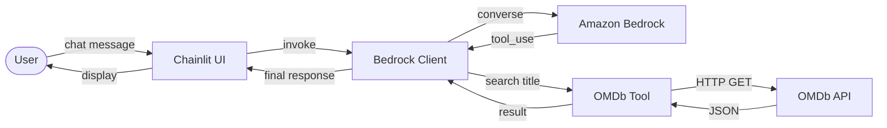

# 🎬 CineAgent

A conversational movie and TV series recommendation agent built with Amazon Bedrock, Chainlit, FastAPI, and the OMDb API.

This project was created for an **AWS Kiro Workshop** to demonstrate how to build an AI-powered chat application using spec-driven development.

## Architecture

```
User → Chainlit UI → Bedrock Client → Amazon Bedrock (Claude 3 Haiku) → OMDb API → Response
```



## Features

- **Natural language movie search** — Ask about any movie or TV series
- **Smart recommendations** — Get 3-5 similar titles based on genre and themes
- **Movie posters** — Displays poster images alongside responses
- **Conversation history** — Past conversations saved and accessible from the sidebar
- **Tool use** — Bedrock decides when to call the OMDb API for real data
- **Error handling** — Graceful timeouts, connection errors, and user-friendly messages

## Example Queries

- "Recommend me a movie similar to Interstellar"
- "Search for Batman movies"
- "What is the plot of The Matrix?"
- "Recommend me a short thriller TV series"
- "Tell me about Breaking Bad"

## Prerequisites

- Python 3.10+ (Python 3.13 recommended)
- AWS account with Amazon Bedrock access (Claude 3 Haiku model enabled)
- OMDb API key (free at https://www.omdbapi.com/apikey.aspx)

## Setup

### 1. Clone and enter the project

```bash
cd CINEAGENT-WORKSHOP
```

### 2. Create a virtual environment

```bash
python3 -m venv .venv
source .venv/bin/activate
```

### 3. Install dependencies

```bash
pip install -r requirements.txt
```

### 4. Configure environment variables

Copy the example and fill in your values:

```bash
cp .env.example .env
```

Edit `.env` with your credentials:

```env
AWS_REGION=us-east-1
AWS_ACCESS_KEY_ID=your_access_key
AWS_SECRET_ACCESS_KEY=your_secret_key
AWS_SESSION_TOKEN=your_session_token  # if using temporary credentials
OMDB_API_KEY=your_omdb_api_key
BEDROCK_MODEL_ID=anthropic.claude-3-haiku-20240307-v1:0
CHAINLIT_AUTH_SECRET=your_random_secret_here
```

To generate a JWT secret:

```bash
python3 -c "import secrets; print(secrets.token_hex(32))"
```

### 5. Run the application

```bash
.venv/bin/python3 -m chainlit run app/main.py
```

Open http://localhost:8000 in your browser.

## Project Structure

```
app/
├── __init__.py           # Package marker
├── api.py                # FastAPI /chat endpoint with error handling
├── bedrock_client.py     # Bedrock Converse API with tool-use loop
├── config.py             # Environment variable loading and validation
├── data_layer.py         # JSON file-based conversation persistence
├── main.py               # Chainlit entry point, wires all components
├── models.py             # Pydantic models and OMDbResult dataclass
└── omdb_tool.py          # OMDb API integration (search by title)

tests/
├── test_api.py           # FastAPI endpoint tests
├── test_bedrock_client.py # Bedrock client unit tests
├── test_config.py        # Configuration validation tests
└── test_omdb_tool.py     # OMDb tool tests
```

## Running Tests

```bash
.venv/bin/python3 -m pytest tests/ -v
```

## How It Works

1. **User sends a message** via the Chainlit chat UI
2. **Bedrock Client** receives the query with conversation history and a system prompt defining CineAgent's persona
3. **Amazon Bedrock** (Claude 3 Haiku) processes the message. If it needs real movie data, it requests a `search_movie` tool call
4. **OMDb Tool** queries the OMDb API by title, returning metadata (title, year, plot, genre, ratings, poster, seasons)
5. **Bedrock** receives the tool result and generates a final human-readable response
6. **Chainlit** displays the movie poster (if available) followed by the text response
7. **Conversation history** is persisted to `.data/threads/` for later retrieval

## Key Design Decisions

- **No frameworks** — The agent loop uses boto3 Converse API directly for transparency
- **Simple architecture** — No AgentCore, no LangChain, just clean Python
- **In-memory sessions** — Conversation history stored in a dict (max 20 messages per session)
- **File-based persistence** — Conversations saved as JSON for the sidebar history
- **Async-safe** — boto3 sync calls wrapped with `asyncio.to_thread()` to avoid blocking

## Tech Stack

| Component | Technology |
|-----------|-----------|
| Frontend | Chainlit 2.11 |
| Backend | FastAPI + Python 3.13 |
| AI Model | Amazon Bedrock (Claude 3 Haiku) |
| Movie Data | OMDb API |
| HTTP Client | httpx (async) |
| Testing | pytest + Hypothesis |

## Workshop Context

This project demonstrates:
- **Spec-driven development** with Kiro IDE
- **Amazon Bedrock Converse API** with tool use
- **Building AI agents** without heavy frameworks
- **Clean Python architecture** for educational purposes

---

Built with ❤️ using [Kiro IDE](https://kiro.dev) and [Amazon Bedrock](https://aws.amazon.com/bedrock/)
